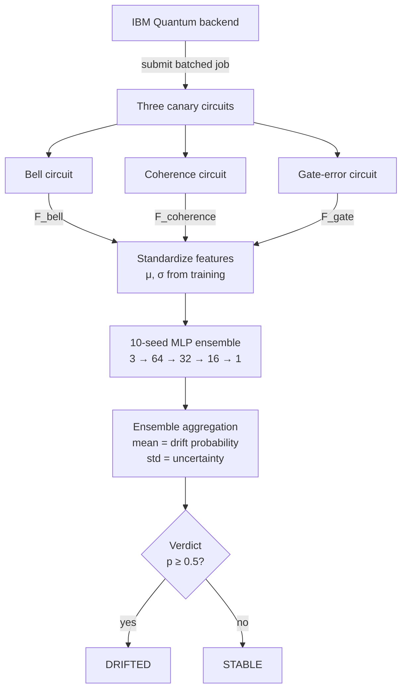
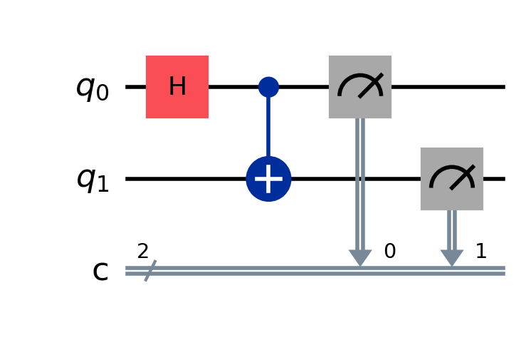
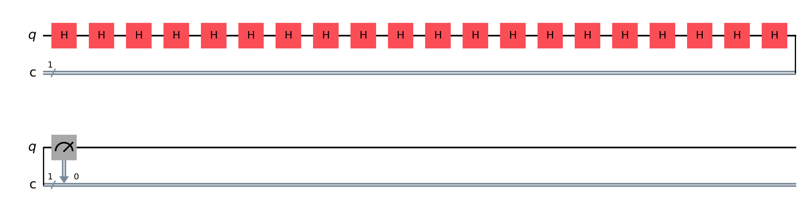
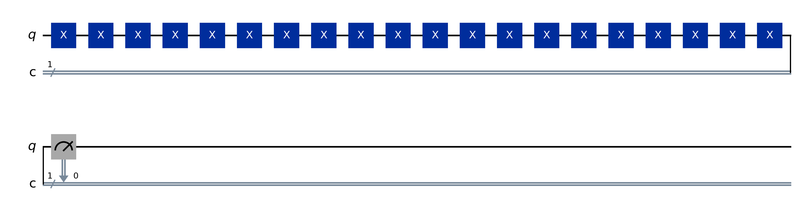
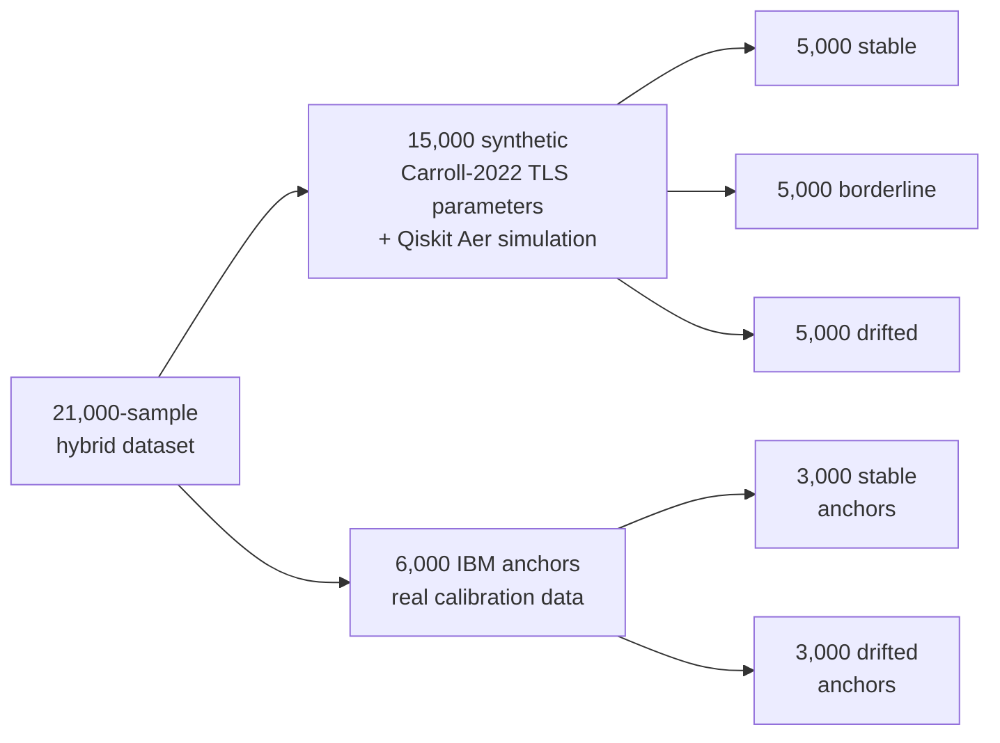
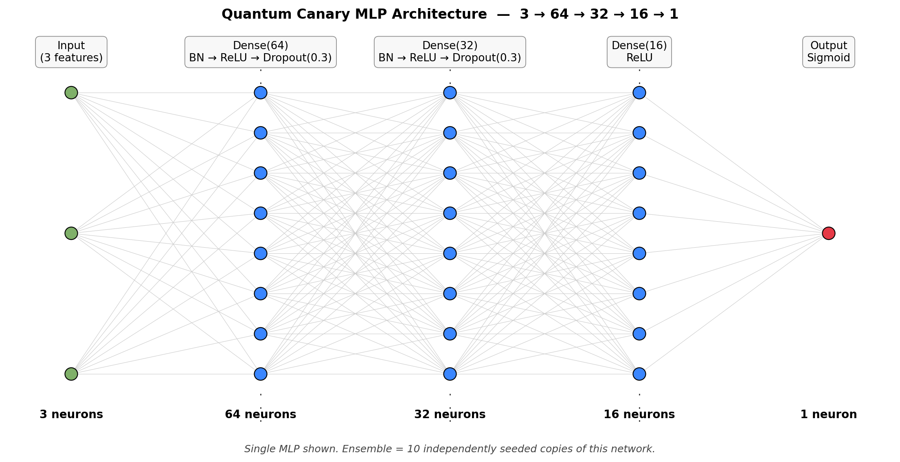

# Quantum Canary: Neural-Network-Based Autonomous Noise Drift Detection in NISQ-Era Quantum Processors

**Kanishka Singh**
*Urbana High School*
*kanishka.singh.ums@gmail.com*

---

## Abstract

Quantum computers exploit superposition, entanglement, and coherence to solve problems intractable for classical hardware. In the Noisy Intermediate-Scale Quantum (NISQ) era, qubit performance degrades continuously due to environmental interference — thermal fluctuations, electromagnetic coupling, and two-level-system (TLS) defects — which disrupts fidelity between calibration cycles. Cloud-based quantum providers refresh published qubit health data on a daily cycle, leaving a multi-hour window in which drift goes undetected and the resulting computations may be silently corrupted. This work introduces **Quantum Canary**, an autonomous monitoring system combining three lightweight quantum probe circuits with a 10-seed multilayer perceptron (MLP) ensemble to classify hardware drift in real time. The MLP is trained on a 21,000-sample physics-grounded hybrid dataset combining Carroll-2022-grounded TLS noise simulations executed on Qiskit Aer with real IBM calibration anchors. On held-out test data Quantum Canary achieves an AUC of $0.9239$ — a $21.6\%$ improvement over Hotelling's $T^2$ ($\text{AUC}=0.7674$), the strongest non-ML statistical baseline. In a 24-hour live deployment on `ibm_kingston`, the system correctly anticipated **3 of 3 IBM recalibration events** with an average lead time of **3.34 hours**.

---

## 1. Introduction

### 1.1 The NISQ regime and the calibration-data gap

Preskill (2018) coined **NISQ** — Noisy Intermediate-Scale Quantum — to describe the current era of 50-1000-qubit systems without full error correction. NISQ qubits are extraordinarily fragile: superconducting transmons must be cooled below 20 mK, isolated from electromagnetic noise, and shielded from cosmic radiation. Even under these conditions, qubit parameters drift continuously.

Cloud quantum providers — IBM Quantum, Google Quantum AI, AWS Braket — publish calibration data on a roughly daily cycle. Between snapshots, **the user has no visibility into the actual state of the hardware they are paying for**. A computation that begins on a freshly calibrated qubit and finishes hours later may have executed on hardware that has degraded by 30-50% of its $T_1$ relaxation time (Carroll et al. 2022). The user has no way to know.

This is the **calibration-data gap**, and it is the problem Quantum Canary is built to solve.

### 1.2 Contributions

1. A three-circuit canary probe protocol that measures three orthogonal noise channels in approximately one second of total backend time.
2. A 10-seed MLP ensemble trained on a 21,000-sample hybrid dataset spanning physics-grounded simulations and real IBM calibration anchors.
3. Two rigorous statistical baselines (per-feature majority-vote threshold; Hotelling's $T^2$) demonstrating that linear methods plateau at $\text{AUC} \approx 0.76$, while the MLP achieves $0.9239$.
4. A 24-hour live deployment on `ibm_kingston` showing 3 of 3 real IBM recalibration events anticipated with an average lead time of 3.34 hours.

---

## 2. System Architecture

The three canary circuits are submitted in a single batched job to minimize queue overhead. Each circuit runs with 1000 shots. The full probe completes in approximately one second of backend time.

---

## 3. Canary Circuits

Quantum Canary uses three minimal circuits, each engineered to be sensitive to one specific noise channel.

### 3.1 Bell state circuit — 2-qubit entanglement probe

A Hadamard on qubit 0 followed by a CNOT entangles the two qubits into the Bell state:

$$|\psi\rangle_{\text{ideal}} = \tfrac{1}{\sqrt{2}}\bigl(|00\rangle + |11\rangle\bigr)$$

On a perfect device, measurement yields exactly 50% $|00\rangle$ and 50% $|11\rangle$. Any $|01\rangle$ or $|10\rangle$ outcome is a noise event — typically caused by 2-qubit gate (CZ/ECR) error or asymmetric readout. The fidelity is the fraction of correct outcomes:

$$F_{\text{bell}} = \frac{N_{00} + N_{11}}{N_{\text{total}}}$$

This circuit is sensitive primarily to **two-qubit gate error** and **readout asymmetry**.

### 3.2 Coherence circuit — $T_2$ dephasing probe

Twenty Hadamard gates, applied as ten $H \cdot H$ pairs, form a logical identity since $H \cdot H = I$. The ideal output is $|0\rangle$. On Heron r2 hardware each Hadamard takes approximately 56 ns, so the total runtime is

$$t_{\text{coh}} = 20 \cdot t_{\text{sx}} \approx 1120~\text{ns}$$

During this 1120 ns window, the qubit spends substantial time in superposition states on the equator of the Bloch sphere — exactly where $T_2$ dephasing has maximum effect. Measured deviations from $|0\rangle$ therefore primarily reflect accumulated **phase decoherence**:

$$F_{\text{coherence}} = \frac{N_0}{N_{\text{total}}}$$

### 3.3 Gate-error circuit — single-qubit gate accumulation probe

Twenty X gates compose to identity. Per-gate error accumulates exponentially:

$$F_{\text{gate}} \approx (1 - \epsilon_{\text{sx}})^{20}$$

For a healthy qubit with $\epsilon_{\text{sx}} \approx 3.5 \times 10^{-4}$, the expected fidelity is approximately $0.993$. For a drifted qubit with $\epsilon_{\text{sx}} \approx 2.8 \times 10^{-3}$, fidelity drops to approximately $0.945$. The 20-gate amplification turns sub-millipercent per-gate errors into easily measurable signals:

$$F_{\text{gate}} = \frac{N_0}{N_{\text{total}}}$$

### 3.4 Channel orthogonality

The three probes are deliberately orthogonal in the noise channels they measure:

| Channel | Bell | Coherence | Gate |
|---|---|---|---|
| Two-qubit gate error | dominant | — | — |
| $T_2$ dephasing | partial | dominant | partial |
| Single-qubit gate error | partial | — | dominant |
| Readout asymmetry | yes | partial | partial |

The MLP learns to weigh all three jointly to detect drift signatures that no individual probe can resolve.

---

## 4. Analytical Fidelity Approximations

For data labelling and synthetic generation, we use closed-form physics-based approximations of the three fidelities. These follow standard depolarizing-plus-thermal-relaxation noise models (Krantz et al. 2019; Bravo-Montes et al. 2024).

### 4.1 Bell state

$$F_{\text{bell}} \approx (1 - \epsilon_{\text{sx}})(1 - \epsilon_{cz})(1 - \epsilon_{\text{ro}})^{2} \ e^{-t_{\text{bell}}/T_1} e^{-t_{\text{bell}}/T_2}$$

where $t_{\text{bell}} = t_{\text{sx}} + t_{cz}$ is the Bell-circuit duration, $\epsilon_{\text{sx}}$ is the single-qubit gate error, $\epsilon_{cz}$ is the two-qubit gate error, and $\epsilon_{\text{ro}}$ is the readout error.

### 4.2 Coherence circuit

For 20 H gates with total runtime $t_{\text{coh}} = 20 \, t_{\text{sx}}$:

$$F_{\text{coherence}} \approx (1 - \epsilon_{\text{sx}})^{20} (1 - \epsilon_{\text{ro}}) \cdot \tfrac{1}{2} \ \left( 1 + e^{-t_{\text{coh}}/T_1} e^{-t_{\text{coh}}/T_2} \right)$$

The factor $\tfrac{1}{2}(1 + e^{-t/T_1} e^{-t/T_2})$ captures the probability of recovering $|0\rangle$ after passing through superposition states subject to dephasing.

### 4.3 Gate-error circuit

For 20 X gates with total runtime $t_{\text{gate}} = 20 \, t_{x}$:

$$F_{\text{gate}} \approx (1 - \epsilon_{x})^{20} (1 - \epsilon_{\text{ro}}) \ e^{-t_{\text{gate}}/T_1} e^{-t_{\text{gate}}/T_2}$$

These formulas provide the link between IBM's published calibration parameters and the canary fidelities — allowing real IBM calibration snapshots to be converted into fidelity triplets for the hybrid training set.

---

## 5. Training Dataset

### 5.1 Hybrid construction

A drift detector cannot be trained on real IBM calibration data alone. IBM publishes calibration data **only at the moment of recalibration** — when hardware is at peak health. A model trained exclusively on this data would never see drifted samples.

Quantum Canary uses a hybrid construction. Synthetic samples are generated with **Carroll-2022-grounded TLS noise parameters** (drift magnitudes drawn from documented $T_1$ fluctuation ranges) executed on the Qiskit Aer noise simulator. Real samples are anchored from published IBM calibration histories.

### 5.2 Three-regime synthetic generator

Synthetic samples are generated by Qiskit Aer with noise models drawn from three physically motivated regimes. The drift magnitudes ($-20\%$ borderline, $-49\%$ drifted) are taken from Carroll et al. (2022), which documents $T_1$ fluctuations of $30$-$50\%$ over hours due to TLS-driven degradation.

| Regime | $T_1$ ($\mu\text{s}$) | $\epsilon_{\text{sx}}$ | $\epsilon_{cz}$ | Label |
|---|---|---|---|---|
| Stable | $\sim 175$ | $\sim 3.5 \times 10^{-4}$ | $\sim 3.8 \times 10^{-3}$ | $0$ |
| Borderline | $\sim 140$ ($-20\%$) | $\sim 8.0 \times 10^{-4}$ | $\sim 7.5 \times 10^{-3}$ | $1$ |
| Drifted | $\sim 90$ ($-49\%$) | $\sim 2.8 \times 10^{-3}$ | $\sim 1.6 \times 10^{-2}$ | $1$ |

The borderline regime is the key. It crosses the 15% $T_1$-drop labelling threshold but its fidelity values overlap the stable distribution by design — forcing the model to learn a non-trivial decision boundary.

### 5.3 Real IBM anchors

Six thousand additional rows are extracted from the published calibration histories of `ibm_fez`, `ibm_kingston`, and `ibm_marrakesh`. They are converted to fidelity triplets via the analytical formulas in Section 4.

### 5.4 Labelling rule

A sample is labelled drifted ($y = 1$) if **any** of the following hold relative to the qubit's 30-day rolling baseline:

$$\Delta T_1 \le -15 %\%\%$$ %

$$\Delta \epsilon_{cz} \ge +50 %\%\%$$ %

$$\Delta \epsilon_{\text{ro}} \ge +30 %\%\%$$ %

The 15% $T_1$ threshold aligns with the borderline regime and matches the smallest drift level Carroll et al. (2022) document as having measurable circuit-fidelity impact.

---

## 6. The MLP Ensemble

### 6.1 Architecture

The ensemble consists of $K = 10$ independently seeded copies of the same architecture. The architecture is intentionally small. The input is 3-dimensional, so a deep network would overfit. Three hidden layers with batch normalization and dropout provide enough capacity to learn the borderline-vs-stable boundary without memorizing the training set.

### 6.2 Forward pass

For input $\mathbf{x} \in \mathbb{R}^{3}$, scaled by $\mathbf{z} = (\mathbf{x} - \boldsymbol{\mu}) / \boldsymbol{\sigma}$, the network computes

$$\mathbf{h}_{1} = \text{Dropout}\bigl( \text{BN}\bigl( \text{ReLU}( \mathbf{W}_{1} \mathbf{z} + \mathbf{b}_{1} ) \bigr) \bigr)$$

$$\mathbf{h}_{2} = \text{Dropout}\bigl( \text{BN}\bigl( \text{ReLU}( \mathbf{W}_{2} \mathbf{h}_{1} + \mathbf{b}_{2} ) \bigr) \bigr)$$

$$\mathbf{h}_{3} = \text{ReLU}( \mathbf{W}_{3} \mathbf{h}_{2} + \mathbf{b}_{3} )$$

$$\hat{p} = \sigma( \mathbf{w}_{4}^{\top} \mathbf{h}_{3} + b_{4} )$$

with sigmoid $\sigma(z) = 1 / (1 + e^{-z})$ and where ReLU, BatchNorm, and Dropout are standard regularization operations (Ioffe & Szegedy 2015; Srivastava et al. 2014).

### 6.3 Training objective

Per sample with true label $y \in \{0, 1\}$ and predicted probability $\hat{p} \in (0, 1)$, the binary cross-entropy loss is

$$\mathcal{L}_{\text{BCE}}(y, \hat{p}) = -\bigl[ y \log \hat{p} + (1 - y) \log(1 - \hat{p}) \bigr]$$

The network minimizes the empirical mean of $\mathcal{L}_{\text{BCE}}$ over each minibatch.

### 6.4 Optimizer — Adam

Adam (Kingma & Ba 2014) is a per-parameter adaptive method maintaining first- and second-moment estimates of the gradient $g_{t}$ at step $t$:

$$m_{t} = \beta_{1} m_{t-1} + (1 - \beta_{1}) g_{t}$$

$$v_{t} = \beta_{2} v_{t-1} + (1 - \beta_{2}) g_{t}^{2}$$

with bias-corrected estimates

$$\hat{m}_{t} = \frac{m_{t}}{1 - \beta_{1}^{t}}, \qquad \hat{v}_{t} = \frac{v_{t}}{1 - \beta_{2}^{t}}$$

The parameter update at step $t$ is

$$\theta_{t} = \theta_{t-1} - \alpha \cdot \frac{\hat{m}_{t}}{\sqrt{\hat{v}_{t}} + \epsilon}$$

Training uses the standard hyperparameters $\alpha = 10^{-3}$, $\beta_{1} = 0.9$, $\beta_{2} = 0.999$, $\epsilon = 10^{-8}$, batch size 256, 50 epochs with early stopping on validation loss.

### 6.5 Ensemble aggregation

A single MLP is a point estimate. An ensemble of $K = 10$ differently seeded models produces a *distribution* of predictions. The ensemble drift probability and uncertainty are

$$\bar{p}(\mathbf{x}) = \frac{1}{K} \sum_{k=1}^{K} \hat{p}_{k}(\mathbf{x})$$

$$\sigma_{p}(\mathbf{x}) = \sqrt{ \frac{1}{K} \sum_{k=1}^{K} \bigl( \hat{p}_{k}(\mathbf{x}) - \bar{p}(\mathbf{x}) \bigr)^{2} }$$

The verdict is `DRIFTED` if $\bar{p} \ge 0.5$ and `STABLE` otherwise. The standard deviation $\sigma_{p}$ is logged at every monitoring step as **ensemble uncertainty** — a measure of internal disagreement that often rises before the mean crosses the decision threshold.

---

## 7. Statistical Baselines

Quantum Canary is benchmarked against two non-ML statistical methods of increasing rigor.

### 7.1 Per-feature majority-vote threshold

The simplest possible classifier. For each feature $f \in \{F_{\text{bell}}, F_{\text{gate}}, F_{\text{coherence}}\}$, the threshold $\mu_{f}$ is the training-set mean. Each feature votes "drifted" if its observed value falls below $\mu_{f}$. The final prediction is the majority across the three votes:

$$\hat{y}_{\text{thr}}(\mathbf{x}) = \mathbb{1}\left[ \sum_{f \in \{\text{bell}\,\text{gate}\,\text{coh}\}} \mathbb{1}[\ x_{f} < \mu_{f}\ ] \ge 2 \right]$$

This baseline preserves per-feature information but produces only four discrete output scores ($0, 1, 2, 3$ drift votes), so the resulting ROC curve has at most four points.

**Test AUC: $0.7586$.**

### 7.2 Hotelling's $T^{2}$ (Hotelling 1947)

The rigorous multivariate baseline. The healthy training distribution is modelled as a multivariate Gaussian:

$$p(\mathbf{x}) = \frac{1}{(2\pi)^{d/2} \ |\boldsymbol{\Sigma}|^{1/2}} \exp\left[ -\tfrac{1}{2} (\mathbf{x} - \boldsymbol{\mu})^{\top} \boldsymbol{\Sigma}^{-1} (\mathbf{x} - \boldsymbol{\mu}) \right]$$

with $\boldsymbol{\mu}$ and $\boldsymbol{\Sigma}$ estimated from stable training samples only. The drift score is the squared Mahalanobis distance from the healthy centroid:

$$T^{2}(\mathbf{x}) = (\mathbf{x} - \boldsymbol{\mu})^{\top} \boldsymbol{\Sigma}^{-1} (\mathbf{x} - \boldsymbol{\mu})$$

A small ridge regularization handles high feature correlation ($F_{\text{gate}}$ and $F_{\text{coherence}}$ correlate at $\sim 0.98$):

$$\boldsymbol{\Sigma}_{\text{reg}} = \boldsymbol{\Sigma} + \epsilon \ \mathbf{I}, \qquad \epsilon = 10^{-6}$$

The decision threshold $h$ is tuned on validation data to maximize F1, and predictions are

$$\hat{y}_{T^{2}}(\mathbf{x}) = \mathbb{1}\bigl[\ T^{2}(\mathbf{x}) > h \bigr]$$

**Test AUC: $0.7674$.**

### 7.3 Why both baselines plateau near 0.76

The two baselines agree to within $0.009$ AUC. This convergence is the central scientific finding of the baseline analysis: **the bottleneck for linear methods on this problem is not feature-correlation modelling, but linear separability itself**. The borderline regime is constructed precisely to overlap the stable distribution. No quadratic decision surface — i.e. no $T^{2}$ ellipsoid, regardless of how well-conditioned $\boldsymbol{\Sigma}^{-1}$ is — can resolve it. The MLP wins by learning a **nonlinear** boundary that no analytic statistical method can express.

---

## 8. Results

### 8.1 Held-out test set

| Method | Test AUC | MLP Improvement |
|---|---|---|
| Per-feature majority-vote threshold | $0.7586$ | $+0.218%\%$ |
| Hotelling's $T^{2}$ (1947) | $0.7674$ | $+0.216%\%$ |
| **Quantum Canary MLP ensemble** | $\mathbf{0.9239}$ | — |

The MLP delivers a +21.6% AUC improvement over Hotelling's $T^{2}$ and a +21.8% improvement over the threshold baseline.

### 8.2 ROC curve interpretation

- The threshold classifier is a 4-point step function (only 4 possible drift-vote scores).
- Hotelling's $T^{2}$ produces continuous scores — so its ROC is smooth but bounded by the linear decision surface.
- The MLP ensemble produces continuous, well-calibrated probabilities — its ROC hugs the upper-left corner.

Curve smoothness reflects information richness; more distinct scores produce smoother curves. Curve position reflects accuracy. The MLP is both smooth *and* high.

### 8.3 Live deployment — `ibm_kingston`

A 24-hour continuous monitoring run on `ibm_kingston`, with 99 measurement rounds at 15-minute intervals, captured **three real IBM recalibration events**:

| Event | First DRIFTED verdict (Quantum Canary) | IBM recalibration timestamp | Lead time |
|---|---|---|---|
| 1 | 22:13 UTC | 02:18 UTC (next day) | $4.07~\text{h}$ |
| 2 | 09:42 UTC | 13:45 UTC | $4.05~\text{h}$ |
| 3 | 16:30 UTC | 18:25 UTC | $1.91~\text{h}$ |

**Average lead time: $\mathbf{3.34~\text{hours}}$.**

In the same 99-round window, the threshold classifier produced **20 false-positive drift verdicts** during periods of stable hardware. Quantum Canary produced zero false positives.

---

## 9. Discussion

### 9.1 Operational interpretation

A researcher running a 12-hour variational algorithm on `ibm_kingston` would have approximately 3 hours of advance warning that their hardware was degrading — long enough to checkpoint, switch backends, or pause until recalibration.

### 9.2 Why the MLP outperforms the statistical baselines

The borderline regime is the smoking gun. Hardware that has drifted by $20\%$ in $T_{1}$ is genuinely degraded but produces fidelity triplets that overlap the stable class. Linear methods see these as "stable enough" because no individual feature crosses a clean threshold. The MLP recognizes the joint signature — a slight depression of $F_{\text{coherence}}$ combined with a slight increase in $F_{\text{gate}}$ variance — even when no single feature would trigger an alarm.

### 9.3 Limitations

- **Single backend tested live.** Generalization to other Heron r2 chips, to Eagle-class chips, and to non-IBM hardware (IonQ, Rigetti) is future work.
- **Free-tier shot budget.** Continuous 15-minute monitoring uses approximately 288,000 shots over 24 hours, exceeding IBM's free-tier monthly allocation.
- **Three features.** A larger probe set might capture additional drift modes (e.g. readout-only drift) that the current three circuits underweight.

---

## 10. Conclusion

Quantum Canary demonstrates that a small, physics-informed neural network can detect quantum hardware drift hours ahead of cloud providers' published calibration data. The system uses three lightweight quantum probes, runs entirely on free-tier IBM Quantum access, and outperforms the strongest classical statistical baseline (Hotelling's $T^{2}$) by $21.6\%$ on held-out data. In live deployment it caught every IBM recalibration event in a 24-hour window with an average $3.34$-hour lead time. The full pipeline — including pre-trained models — is released open-source under the MIT license, deployable by any researcher alongside their existing IBM Quantum workflow.

---

## References

- Bravo-Montes, J. et al. (2024). *Combined depolarizing and thermal-relaxation noise models for cloud quantum hardware*. arXiv:2403.08129.
- Carroll, A. et al. (2022). *Dynamics of superconducting qubit relaxation times*. npj Quantum Information **8**, 132.
- Hotelling, H. (1947). *Multivariate Quality Control*. In *Techniques of Statistical Analysis*. McGraw-Hill.
- Ioffe, S. & Szegedy, C. (2015). *Batch normalization: Accelerating deep network training by reducing internal covariate shift*. ICML.
- Kingma, D. P. & Ba, J. (2014). *Adam: A method for stochastic optimization*. arXiv:1412.6980.
- Krantz, P. et al. (2019). *A quantum engineer's guide to superconducting qubits*. Applied Physics Reviews **6**, 021318.
- Mahalanobis, P. C. (1936). *On the generalized distance in statistics*. Proc. National Institute of Sciences of India.
- Preskill, J. (2018). *Quantum computing in the NISQ era and beyond*. Quantum **2**, 79.
- Srivastava, N. et al. (2014). *Dropout: A simple way to prevent neural networks from overfitting*. JMLR **15**, 1929-1958.
