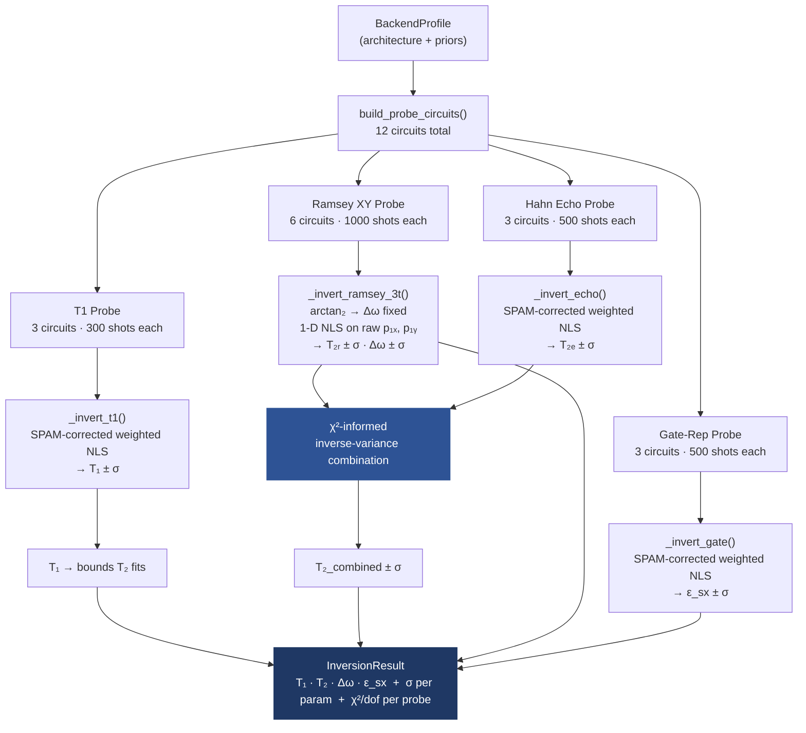
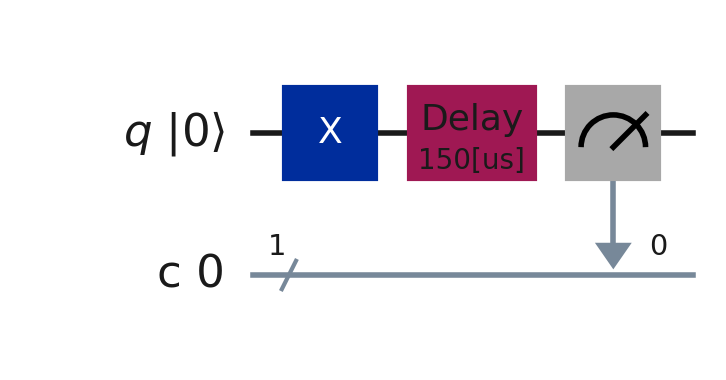
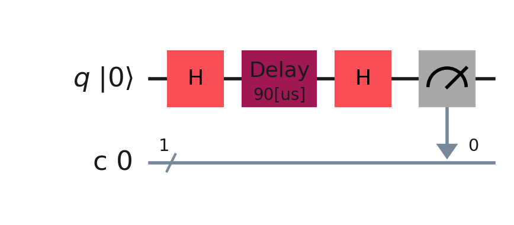
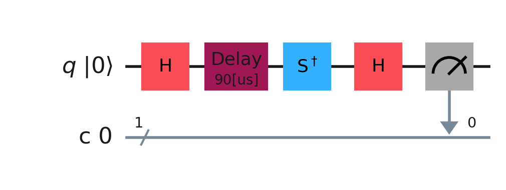
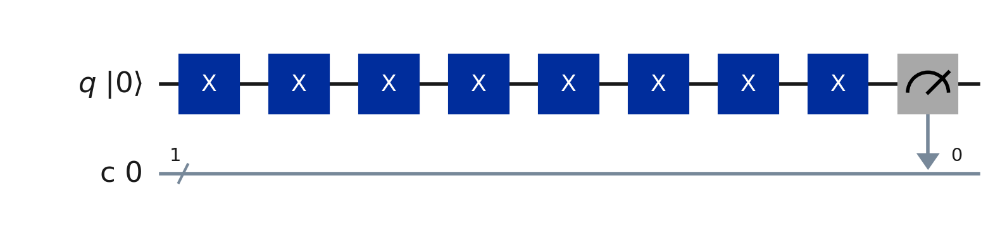
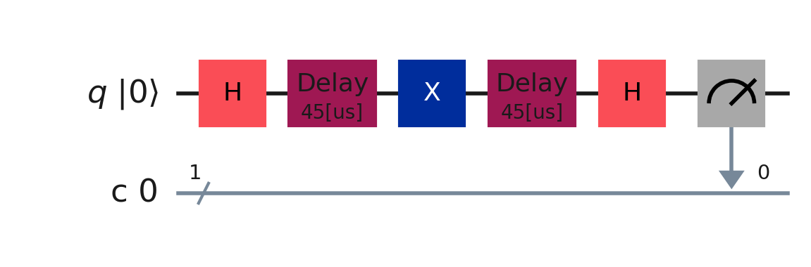
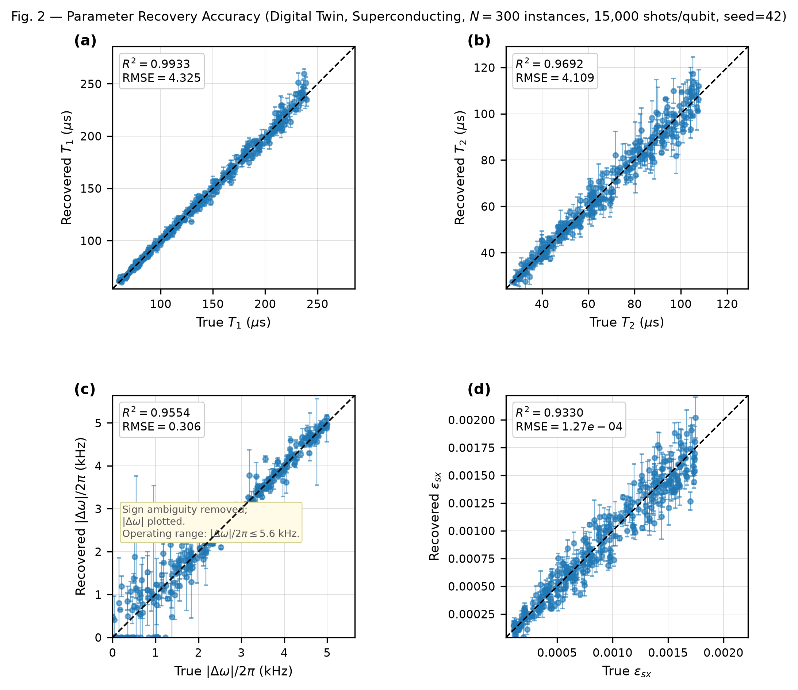
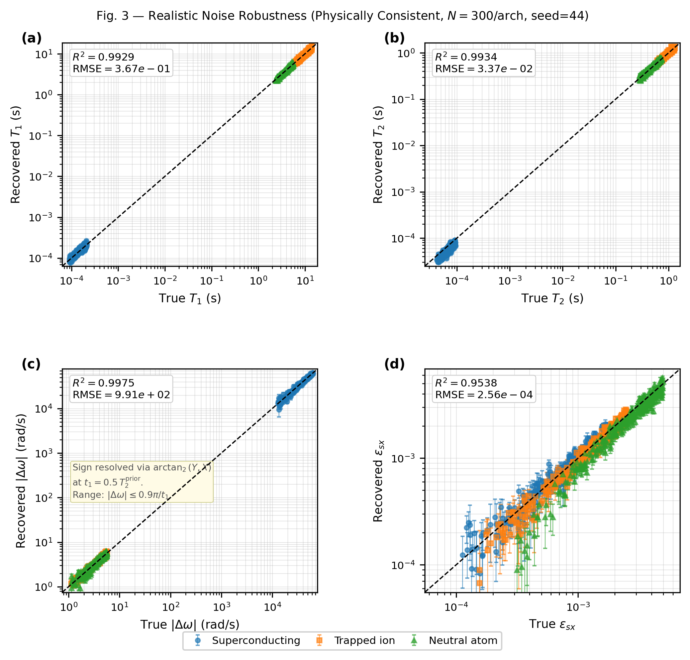

# Quantum Canary

**Physics-Consistent Lindblad Parameter Inversion for Efficient Qubit Characterization**

Primary function: extracts $T_1$, $T_2$, $\Delta\omega$, and $\varepsilon_{sx}$ from qubits spanning various architectures using 12 circuits and 9,900 shots total. 

 

---

## Pipeline

---

## Four Probe Families

### 1 · T1 Decay

Prepares $|1\rangle$, waits $\tau$, measures. Three delays at $\tau \in \{0.5,\, 1.0,\, 1.5\} \times T_1^{\text{prior}}$.

$$P_{\text{meas}}(1;\,\tau) = e^{-\tau/T_1}(1 - p_{0|1}) + \bigl(1 - e^{-\tau/T_1}\bigr)\, p_{1|0}$$

A closed-form 3-point algebraic estimate seeds `curve_fit`, keeping $T_1$ as the only free parameter.

---

### 2 · Ramsey XY

Both X- and Y-basis readouts at each delay $\tau \in \{0.5,\, 1.0,\, 1.5\} \times T_2^{\text{prior}}$.

**X-basis** — $|{+}\rangle \xrightarrow{\tau} H \to$ measure:

**Y-basis** — $S^\dagger$ before final $H$ shifts the readout axis by $90°$:

$$P_X(1;\,\tau) = \tfrac{1}{2}\left(1 - e^{-\tau/T_2}\cos\bigl(\Delta\omega\,\tau\bigr)\right)$$

$$P_Y(1;\,\tau) = \tfrac{1}{2}\left(1 - e^{-\tau/T_2}\sin\bigl(\Delta\omega\,\tau\bigr)\right)$$

**Sequential estimation.** 

1. Fix $\Delta\omega$ from $\arctan_2(y_0, x_0) / t_1$ at the shortest delay — no fitting needed, exact.
2. With $\Delta\omega$ locked, fit $T_2$ as a **1-D problem** on raw $(p_{1x},\, p_{1y})$ — wellconditioned, unique solution.

---

### 3 · Gate Repetition

$2N$ alternating X gates. At $N \in \{20,\, 40,\, 80\}$ the accumulated depolarizing error is large enough to measure precisely.

$$P_{\text{meas}}(0;\,N) = \tfrac{1}{2}\left(1 + (1-2\varepsilon_{sx})^{2N}\right)(1-p_{0|1}) + \tfrac{1}{2}\left(1 - (1-2\varepsilon_{sx})^{2N}\right)p_{1|0}$$

---

### 4 · Hahn Echo

A $\pi$-pulse at the midpoint refocuses static dephasing and low-frequency noise, leaving only irreversible decoherence. Gives an independent $T_2$ estimate orthogonal to Ramsey.

$$P_{\text{meas}}(1;\,\tau) = \tfrac{1}{2}\left(1 - e^{-\tau/T_{2,\text{echo}}}\right)(1 - p_{0|1}) + \tfrac{1}{2}\left(1 + e^{-\tau/T_{2,\text{echo}}}\right)p_{1|0}$$

---

## SPAM Correction

Real hardware misclassifies qubit states. Every forward model applies the readout map before fitting:

$$p_{\text{meas}} = p_{\text{ideal}}\,(1 - p_{0|1}) + (1 - p_{\text{ideal}})\, p_{1|0}$$

where $p_{0|1} = P(\text{read } 0 \mid \text{true } 1)$ and $p_{1|0} = P(\text{read } 1 \mid \text{true } 0)$. These are **fixed per-architecture constants** — not free fit parameters — sourced from published hardware specs. Keeping them fixed prevents parameter-count inflation and preserves the physical meaning of the inversion.

| Architecture | $p_{0\|1}$ | $p_{1\|0}$ | Citation/Platform Context |
|:---|:---:|:---:|:---|
| Superconducting | 0.0092 | 0.0009 | Chen et al. (2023), *Transmon qubit readout fidelity at the threshold for fault-tolerant quantum computing* |
| Trapped ion | 0.0005 | 0.0018 | Mai et al. (2024), *High-Fidelity Detection on $^{171}\text{Yb}^+$ Qubit via $^{2}\text{D}_{3/2}$ Shelving* |
| Neutral atom | 0.0060 | 0.0040 | Evered et al. (2023), *High-fidelity parallel entangling gates on a neutral-atom quantum computer* |

---

## Inversion

All four probes use shot-noise-weighted nonlinear least squares. The per-point weight is:

$$\sigma_i = \sqrt{\frac{p_i(1-p_i)}{N_{\text{shots}}}}$$

passed to `curve_fit` with `absolute_sigma=True`. This ensures the optimizer trusts data proportionally to how many shots actually constrain each point — low-SNR points don't drag the fit.

Physical bounds are enforced **inside** the optimizer (not as post-hoc clips):

$$T_2 \leq 2T_1 \qquad \text{(from } 1/T_2 = 1/(2T_1) + 1/T_\phi\text{)}$$

$$\varepsilon_{sx} \in [0,\; \varepsilon_{\max}], \qquad |\Delta\omega| \leq 0.9\pi/t_1$$

**Why sequential equals joint Lindblad.** Under Markovian noise, each decoherence channel enters through an independent Lindblad operator. The joint parameter likelihood factorizes across probes — meaning sequential single-probe inversion gives the same result as a full joint fit, at a fraction of the cost.

---

## $T_2$ Combination

Ramsey and Echo give two independent $T_2$ estimates with different noise sensitivities. They're combined using $\chi^2$-informed inverse-variance weighting:

$$w_i = \frac{1}{\sigma_i^2 \cdot \max\left(\chi^2_i/\text{dof},\; 1\right)}, \qquad T_{2,\text{combined}} = \frac{w_R\, T_{2,R} + w_E\, T_{2,E}}{w_R + w_E}$$

When a probe's model fits the data well ($\chi^2/\text{dof} \approx 1$), it gets full weight. When unmodeled physics is present — 1/f noise contaminating Ramsey, for example — its $\chi^2$ elevates and it gets automatically downweighted in favor of Echo. No prior knowledge of which probe is contaminated is needed; the fit quality tells you.

Each probe's $\chi^2/\text{dof}$ is reported in `InversionResult`, so you can see exactly which probe is struggling and why.

---

## Results

### Fig. 2 — Parameter Recovery, Digital Twin

$N = 300$ instances per architecture, 9,900 shots/qubit, seed = 43. Ground truth is available because data is generated synthetically — real hardware never reveals true $T_1$/$T_2$/$\Delta\omega$/$\varepsilon_{sx}$.

| Parameter | $R^2$ | RMSE |
|:---|:---:|:---|
| $T_1$ | 0.9944 | $3.24 \times 10^{-1}$ s |
| $T_2$ | 0.9951 | $3.56 \times 10^{-2}$ s |
| $\|\Delta\omega\|$ | 0.9989 | $6.41 \times 10^{2}$ rad/s |
| $\varepsilon_{sx}$ | 0.9796 | $1.65 \times 10^{-4}$ |

---

### Fig. 3 — Noise Robustness, Physically Consistent

$N = 300$ instances per architecture, seed = 44. True $(T_1, T_2)$ pairs drawn via $T_2 = 1/(1/(2T_1) + 1/T_\phi)$, guaranteeing physical self-consistency. Unmodeled noise is injected per platform — this is where the method gets stress-tested against things it doesn't know about:

- **Superconducting:** per-instance TLS $T_1$/$T_2$ drift (8% std), SPAM drift, 1/f Ramsey dephasing
- **Trapped ion:** magnetic-field $\Delta\omega$ drift between delays, micromotion phase modulation, motional $T_1$ heating
- **Neutral atom:** laser-intensity gate-error jitter, tweezer-position $\Delta\omega$ jitter, dephasing-dominated $T_2 \ll T_1$ regime

| Parameter | $R^2$ under realistic noise |
|:---|:---:|
| $T_1$ | 0.9929 |
| $T_2$ | 0.9934 |
| $\|\Delta\omega\|$ | 0.9975 |
| $\varepsilon_{sx}$ | 0.9538 |

All $R^2 \geq 0.95$ across all four parameters and all three architectures. Fit-failure rate: **0.00%**.

---
