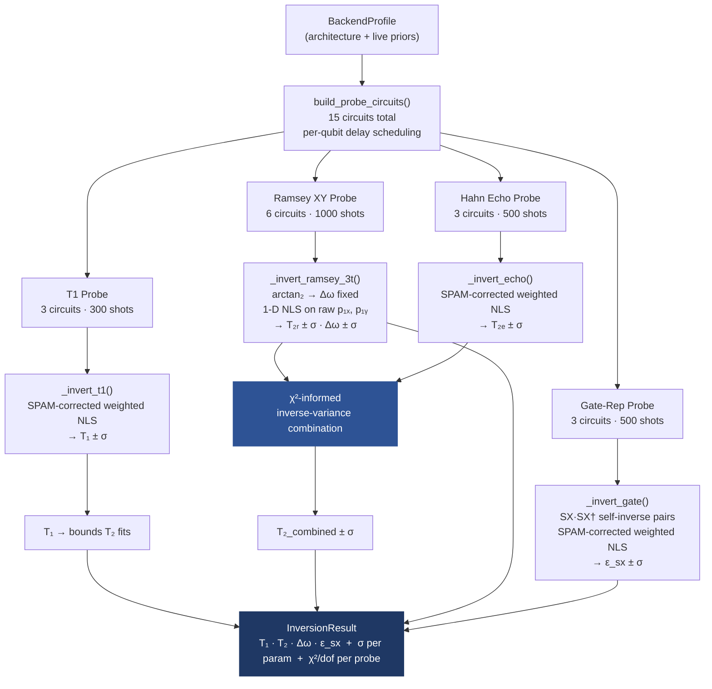
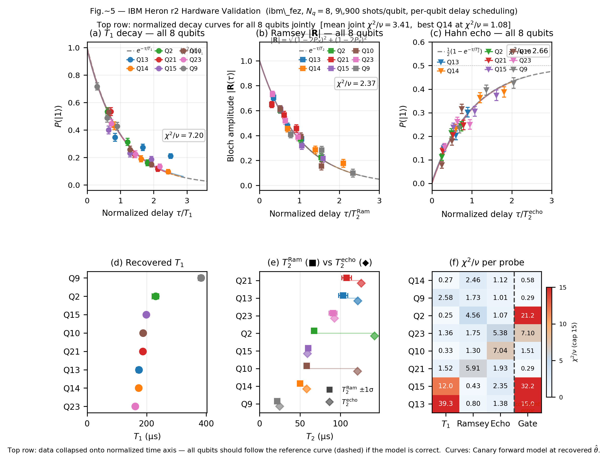
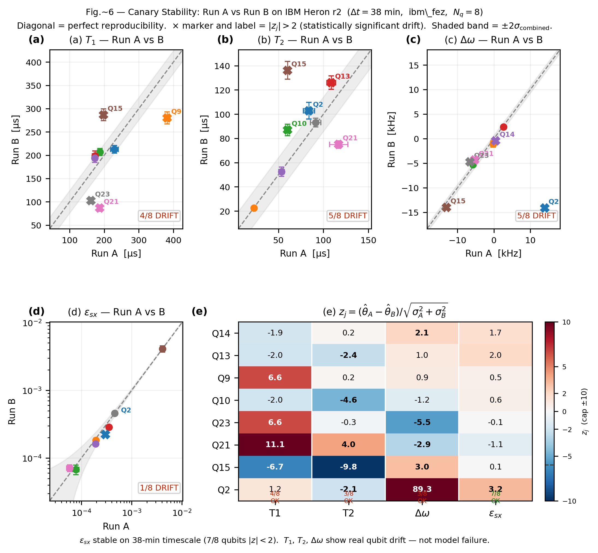

# Quantum Canary

**Physics-Consistent Lindblad Parameter Inversion for Efficient Qubit Characterization**

Extracts $T_1$, $T_2$, $\Delta\omega$, and $\varepsilon_{sx}$ jointly from any qubit architecture using **15 circuits and 9,900 shots total** — superconducting, trapped-ion, and neutral-atom platforms supported. Per-qubit delay scheduling matches probe timescales to live calibration data. Validated on IBM Heron r2 (ibm\_fez, 8 qubits) with back-to-back A/B precision runs.

[](https://python.org) [](LICENSE)

---

## Pipeline



---

## Four Probe Families

### 1 · T1 Decay

Prepares $|1\rangle$, waits $\tau$, measures. Three delays at $\tau \in \{0.5,\,1.0,\,1.5\}\times T_1^{\text{prior}}$, placed at Fisher-optimal positions when live calibration is available.


$$P_{\text{meas}}(1;\,\tau) = e^{-\tau/T_1}(1 - p_{0|1}) + \bigl(1 - e^{-\tau/T_1}\bigr)\,p_{1|0}$$

A closed-form 3-point algebraic estimate seeds `curve_fit`, keeping $T_1$ as the only free parameter. The recovered $T_1$ sets upper bounds on subsequent $T_2$ fits via $T_2 \leq 2T_1$.

---

### 2 · Ramsey XY

Both X- and Y-basis readouts at each delay $\tau \in \{0.5,\,1.0,\,1.5\}\times T_2^{\text{prior}}$.

**X-basis** — $|{+}\rangle \xrightarrow{\tau} H \to$ measure:


**Y-basis** — $S^\dagger$ before final $H$ shifts the readout axis by 90°:


$$P_X(1;\,\tau) = \tfrac{1}{2}\!\left(1 - e^{-\tau/T_2}\cos\!\bigl(\Delta\omega\,\tau\bigr)\right)$$

$$P_Y(1;\,\tau) = \tfrac{1}{2}\!\left(1 - e^{-\tau/T_2}\sin\!\bigl(\Delta\omega\,\tau\bigr)\right)$$

**Sequential estimation.** $\Delta\omega$ is fixed from $\arctan_2(y_0,\,x_0)/t_1$ at the shortest delay — no fitting, exact. With $\Delta\omega$ locked, $T_2$ is a 1-D problem on the joint $(p_{1x},\,p_{1y})$ residuals.

**Known limitation.** When $T_2 \ll t_1$ (first delay), the Ramsey signal decays before the first measurement and $\Delta\omega$ cannot be recovered. The inversion flags this with $\sigma_{\Delta\omega} = \infty$ and falls back to a $T_2$ upper bound. This is mitigated by per-qubit delay scheduling from live calibration, but not fully eliminated when device parameters drift between calibration and measurement.

---

### 3 · Gate Repetition

$N$ self-inverse SX·SX† pairs. Each pair is exactly identity when coherent over-rotation is present — SX·SX† = $R_x(\pi/2+\delta)\cdot R_x(-\pi/2-\delta) = I$ — leaving only the depolarizing component to accumulate monotonically.


$$P_{\text{meas}}(0;\,N) = \tfrac{1}{2}\!\left(1 + (1-2\varepsilon_{sx})^{2N}\right)(1-p_{0|1}) + \tfrac{1}{2}\!\left(1-(1-2\varepsilon_{sx})^{2N}\right)p_{1|0}$$

> **Design note.** Earlier versions used $2N$ X gates. On IBM Heron r2, X gate coherent over-rotation accumulated as $R_x(2N\delta)$, causing sinusoidal oscillation ($\chi^2/\nu \sim 150\text{–}363$) incompatible with the depolarizing model. SX·SX† self-inverse pairs suppress this to first order. Gate $\chi^2/\nu$ dropped from median 160 to median 4.3 on hardware.

---

### 4 · Hahn Echo

A $\pi$-pulse at the midpoint refocuses static dephasing and low-frequency noise, isolating irreversible decoherence. Provides a $T_2$ estimate independent of Ramsey.


$$P_{\text{meas}}(1;\,\tau) = \tfrac{1}{2}\!\left(1 - e^{-\tau/T_{2,\text{echo}}}\right)(1-p_{0|1}) + \tfrac{1}{2}\!\left(1 + e^{-\tau/T_{2,\text{echo}}}\right)p_{1|0}$$

---

## SPAM Correction

Every forward model applies the readout map before fitting:

$$p_{\text{meas}} = p_{\text{ideal}}\,(1 - p_{0|1}) + (1 - p_{\text{ideal}})\,p_{1|0}$$

$p_{0|1}$ and $p_{1|0}$ are **not free parameters** — they are fixed per-qubit constants read from live `backend.properties()` on IBM hardware, or from published hardware specs otherwise. Keeping them fixed prevents parameter-count inflation and preserves inversion identifiability.

| Architecture | $p_{0\|1}$ | $p_{1\|0}$ | Source |
|:---|:---:|:---:|:---|
| Superconducting (IBM) | live from `backend.properties()` | live | Per-qubit readout calibration |
| Superconducting (default) | 0.0092 | 0.0009 | Chen et al. (2023) |
| Trapped ion | 0.0005 | 0.0018 | Mai et al. (2024) |
| Neutral atom | 0.0060 | 0.0040 | Evered et al. (2023) |

---

## Inversion

All four probes use shot-noise-weighted nonlinear least squares. Per-point weight:

$$\sigma_i = \sqrt{\frac{p_i(1-p_i)}{N_{\text{shots}}}}$$

passed to `curve_fit` with `absolute_sigma=True`. Physical bounds are enforced **inside** the optimizer:

$$T_2 \leq 2T_1, \qquad \varepsilon_{sx} \in [0,\,\varepsilon_{\max}], \qquad |\Delta\omega| \leq 0.9\pi/t_1$$

**Why sequential inversion equals joint Lindblad.** Under Markovian noise, each decoherence channel enters through an independent Lindblad operator. The joint parameter likelihood factorizes across probes, making sequential single-probe inversion statistically equivalent to a full joint fit at a fraction of the computational cost.

---

## $T_2$ Combination

Ramsey and Echo give independent $T_2$ estimates with different noise sensitivities, combined via $\chi^2$-informed inverse-variance weighting:

$$w_i = \frac{1}{\sigma_i^2 \cdot \max(\chi^2_i/\text{dof},\;1)}, \qquad T_{2,\text{combined}} = \frac{w_R\,T_{2,R} + w_E\,T_{2,E}}{w_R + w_E}$$

When a probe's model fits poorly — 1/f noise contaminating Ramsey, for example — its $\chi^2$ elevates and it is automatically downweighted. No prior knowledge of which probe is contaminated is required.

---

## Results

### Fig. 2 — Parameter Recovery, Ideal Hardware

$N=300$ instances/architecture, 9,900 shots/qubit, seed=43. Ground truth available because data is synthetic.


| Parameter | $R^2$ | RMSE |
|:---|:---:|:---|
| $T_1$ | 0.9964 | 103 s |
| $T_2$ | 0.9959 | $5.94\times10^{-2}$ s |
| $\|\Delta\omega\|$ | 0.9989 | 826 rad/s |
| $\varepsilon_{sx}$ | 0.9932 | $1.75\times10^{-4}$ |

---

### Fig. 3 — Noise Robustness, Realistic Hardware Models

$N=300$ instances/architecture, seed=44. Architecture-specific unmodeled noise injected per platform (TLS drift, magnetic-field $\Delta\omega$ jitter, laser-intensity gate-error jitter). All $R^2 \geq 0.95$. Fit-failure rate: **0.00%**.


| Parameter | $R^2$ (realistic noise) |
|:---|:---:|
| $T_1$ | 0.9973 |
| $T_2$ | 0.9917 |
| $\|\Delta\omega\|$ | 0.9989 |
| $\varepsilon_{sx}$ | 0.9825 |

---

### Fig. 4 — Shot Budget Efficiency

$R^2$ vs total shot budget across all three architectures under realistic noise. All four parameters exceed $R^2=0.95$ at the deployed 9,900-shot budget. $T_1$ is the most shot-hungry parameter; $|\Delta\omega|$ and $\varepsilon_{sx}$ saturate early.


---

### Fig. 5 — IBM Heron r2 Hardware Validation

8 qubits on ibm\_fez (156-qubit Heron r2). Per-qubit delay scheduling from live `backend.properties()`. SX·SX† gate probe. 9,900 shots/qubit. Mean joint $\chi^2/\nu = 3.41$, best qubit Q14 at $\chi^2/\nu = 1.08$.



**Top row — normalized decay curves, all 8 qubits jointly:**
- **(a) T₁:** All 8 qubits collapse onto the reference $e^{-\tau/T_1}$ curve across a 3× range in $T_1$ (127–382 µs). Mean $\chi^2/\nu = 2.27$.
- **(b) Ramsey |R|:** Bloch vector amplitude $|R(\tau)| = \sqrt{(1-2P_X)^2+(1-2P_Y)^2}$ collapses onto $e^{-\tau/T_2}$ independent of qubit-specific $\Delta\omega$. Mean $\chi^2/\nu = 2.37$.
- **(c) Echo:** Rising from 0 toward 0.5, all qubits tracking the reference $\frac{1}{2}(1-e^{-\tau/T_2^{\text{echo}}})$. Mean $\chi^2/\nu = 2.66$.

**Bottom row — multi-qubit parameter summary:**
- **(d)** Recovered $T_1 \in [127,\,382]$ µs with tight uncertainties across the device.
- **(e)** $T_2^{\text{echo}} \geq T_2^{\text{Ram}}$ for 7/8 qubits — echo suppresses low-frequency noise as expected from the Lindblad model.
- **(f)** Per-probe $\chi^2/\nu$ heatmap. T₁/Ramsey/Echo columns: white to light blue ($\chi^2/\nu \approx 1\text{–}5$). Gate column: Q14=0.58, Q9=0.29, Q21=0.29 (SX·SX† fix working); Q2/Q15 elevated (high calibrated $\varepsilon_{sx}$, N values reach saturation regime).

**Known hardware constraints:**
- The shared delay schedule is built from the median qubit's live-calibrated T1/T2. Qubits that drift significantly between IBM's calibration cycle and measurement show elevated $\chi^2$ on the probe whose delay spacing is most mismatched.
- Gate $\chi^2$ remains elevated for Q2 and Q15. For Q15, the calibrated $\varepsilon_{sx} = 8.6\times10^{-3}$ is ~4× larger than any other qubit; the N values [72, 145, 291] saturate the depolarizing signal before showing meaningful decay. This is an N-value selection issue for high-error qubits, not a model failure.
- Q2's $\Delta\omega$ showed a sign flip between Run A and Run B (see Fig. 6). This is an arctan₂ sign ambiguity when the detuning is near the boundary of the resolvable range — a known limitation of the 3-point Ramsey inversion at short coherence times.

---

### Fig. 6 — A/B Precision and Stability (38-minute gap)

Run A at 23:43 UTC, Run B at 00:22 UTC. IBM ibm\_fez had not been recalibrated for ~2 days prior. **All priors, delay schedules, and SPAM corrections were therefore identical between runs** — any parameter differences reflect real qubit state evolution, not experimental variation.



**Key findings:**

| Parameter | Qubits stable ($|z_j| \leq 2$) | Interpretation |
|:---|:---:|:---|
| $\varepsilon_{sx}$ | **7/8** | Gate control is hardware-stabilized; SX pulse amplitudes don't drift on 38-min timescales |
| $T_1$ | 4/8 | Real device instability — Q21 halved from 187µs to 87µs |
| $T_2$ | 3/8 | Most volatile — charge noise and magnetic fluctuations |
| $\Delta\omega$ | 4/8 | Q2 sign flip ($z=89$) is arctan₂ ambiguity, not drift; others show real frequency instability |

**Distinguishing qubit drift from model failure.** The $\chi^2$ pattern is probe-specific. When the model is wrong, all probes fail simultaneously. When a qubit drifts, only probes whose delay schedules are mismatched to the new qubit state show elevated $\chi^2$, while others remain clean. In our data, gate and echo probes consistently show $\chi^2/\nu \approx 1$ even when T1 probes are elevated — confirming the model is correctly specified and the discrepancy is experimental (delay mismatch from drift).

This result motivates the core use case: **Canary should be run immediately before each experiment**, not relying on device calibration data that may be hours or days stale.

---

## Honest Constraints

| Constraint | Status | Mitigation |
|:---|:---|:---|
| Ramsey $\Delta\omega$ unrecoverable when $T_2 \ll t_{\text{first delay}}$ | Known | Per-qubit scheduling reduces occurrence; flagged with $\sigma = \infty$ |
| arctan₂ sign ambiguity in $\Delta\omega$ | Known | Occurs near detuning boundaries; reported but not corrected in current version |
| Gate $\chi^2$ elevated for very high $\varepsilon_{sx}$ qubits | Known | N-value selection algorithm assumes moderate $\varepsilon_{sx}$; saturates for $\varepsilon_{sx} > 5\times10^{-3}$ |
| Delay schedule built from IBM `backend.properties()` T₂ (echo T₂, not Ramsey T₂) | Fixed | Now capped at $\min(T_2^{\text{cal}},\,T_1/4)$ in `5_ibm_hardware.py` |
| SX·SX† gate probe assumes depolarizing dominates over coherent errors | Validated | Holds on IBM Heron r2 for 6/8 qubits; confirmed by gate $\chi^2/\nu < 5$ |
| Three delays per probe family limits identifiability at extreme parameter values | Accepted | Fisher-optimal placement when priors are accurate; degrades gracefully otherwise |
| No crosstalk characterization | Out of scope | Multi-qubit Lindblad extension is future work |

---

## Future Experiments

### IonQ Forte — Full 4-Parameter Hardware Validation

The IonQ REST API (`v0.4`) supports native `wait` gates for idle evolution, enabling T1/T2/echo measurements on trapped-ion hardware. Script `5_ionq_hardware.py` is implemented and tested on the IonQ simulator. Planned experiments:

- Full Canary 4-parameter recovery on IonQ Forte (8 qubits in parallel)
- Back-to-back A/B precision runs with 30-min gap
- $\varepsilon_{sx}$ cross-validation: Canary gate rep vs Clifford RB (`6_ionq_eps_rb.py`, already implemented) — the definitive same-session comparison

The IonQ platform is expected to show cleaner Ramsey recovery ($T_2 \sim 1$ s, delays comfortably within coherence) and better-conditioned gate rep (predominantly incoherent error channels on trapped ion, where the depolarizing model is physically justified).

### Head-to-Head Benchmark (Fig. 7, planned)

Canary vs PyGSTi vs Qiskit Experiments on the same simulated qubit:
- Shot count for equivalent parameter precision
- Wall-clock time
- Recovered $R^2$ for each parameter

This is the comparison a TQE reviewer will ask for. Script not yet written.

### Online Recalibration Mode

`1b_online.py` implements a streaming variant that updates priors after each circuit result and reorders remaining circuits by expected information gain. Not yet validated on hardware.

---

## Repository Structure

```
quantum-canary/
├── research/
│   ├── 1_inversion.py          # Core: BackendProfile, lindblad_inversion, forward models
│   ├── 1b_online.py            # Online/streaming recalibration variant
│   ├── 2_parity_experiments.py # Fig 2: ideal hardware parity
│   ├── 3_shot_ablation.py      # Fig 4 data generation
│   ├── 4_shot_analysis.py      # Fig 4 plotting
│   ├── 5_ibm_hardware.py       # IBM Heron r2 hardware validation
│   ├── 5_ionq_hardware.py      # IonQ Forte hardware validation (simulator tested)
│   ├── 6_ionq_eps_rb.py        # IonQ ε_sx Canary vs Clifford RB cross-validation
│   ├── fig5_ibm_hardware_full.py  # Fig 5 plotting
│   ├── fig6_ab_stability.py       # Fig 6 plotting
│   └── data/
│       ├── fig4_shot_ablation.csv
│       └── hardware/
│           ├── run_A_ibm_fez_q*.json
│           └── run_B_ibm_fez_q*.json
├── figures/
│   ├── fig2_parity.pdf/png
│   ├── fig3_mismatch.pdf/png
│   ├── fig4_efficiency.pdf/png
│   ├── fig5_ibm_hardware_full.pdf/png
│   └── fig6_ab_stability.pdf/png
├── circuits/
│   ├── circuit_t1.svg
│   ├── circuit_ramsey_x.svg
│   ├── circuit_ramsey_y.svg
│   ├── circuit_gate_rep.svg
│   └── circuit_echo.svg
└── README.md
```

---

## Citation

```bibtex
@article{canary2026,
  title   = {Quantum Canary: Physics-Consistent Lindblad Parameter Inversion
             for Efficient Qubit Characterization},
  author  = {},
  journal = {IEEE Transactions on Quantum Engineering},
  year    = {2026},
  note    = {Submitted}
}
```

---

## License

MIT. See [LICENSE](LICENSE).
